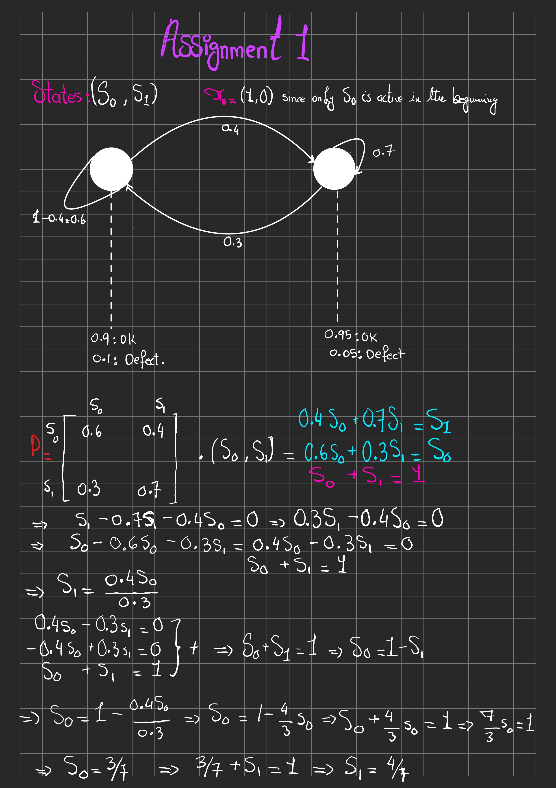

# Phase 1: DTMC Baseline Modeling

## Objective
Establish the baseline state-space probability distribution. This module computes transient system states and long-term equilibrium (steady-state) to mathematically prove the baseline operational defect rate before failure.


<center></center>


## System Parameters
* **State Space:** $S = \{S_0, S_1\}$ (Representing active upstream sources)
**Initial State:** $\pi_0 = [1.0, 0.0]$ 
**Transition Matrix ($P$):** The probability to switch from source 0 to source 1 is 0.4. The one-step transition from source 1 to source 0 is 0.3.
  $$P = \begin{bmatrix} 0.6 & 0.4 \\ 0.3 & 0.7 \end{bmatrix}$$
**Emission Probabilities:** Target operational yields are 0.9 for source 0 and 0.95 for source 1.

## Execution Logic
* **`dtmc.py`**: The core mathematical engine. Executes Transient Analysis ($\pi_t = \pi_0 P^t$) via NumPy matrix power and calculates steady-state limits using Iterative Power Methods, with an automatic fallback to direct linear equation solving for complex matrices.
* **`simulator.py`**: A Markov Chain Monte Carlo (MCMC) engine. Executes localized random walks to generate empirical validation for the theoretical matrix limits.

## Deployment
```bash
pip install -r requirements.txt
python src/main.py