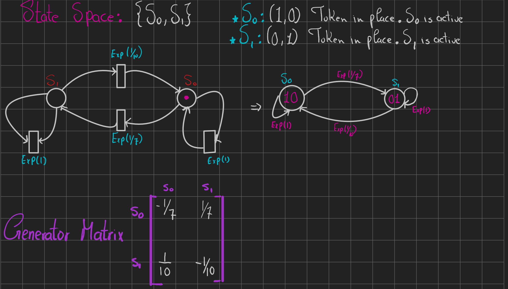

# Phase 3: Generalized Stochastic Petri Nets (GSPN)

## Objective
Model the quality tester utilizing a GSPN framework to evaluate concurrent state behaviors and token distribution. The GSPN is mapped to an Extended Reachability Graph (ERG) and converted into a CTMC to solve for steady-state throughput and place probabilities.

 

 
 

 

## Architectural Mapping
* **Places:** $P = \{P_{S0}, P_{S1}\}$
* **Initial Marking ($M_0$):** $(1, 0)$
* **State Space:** $\{S_0, S_1\}$

## Transition Kinetics
* **$S_0 \rightarrow S_1$:** Rate = $1/7 \approx 0.1429$
* **$S_1 \rightarrow S_0$:** Rate = $1/10 = 0.1000$
* **Production (Self-Loop):** Rate = $1.0$

## Generator Matrix ($Q$)
$$Q = \begin{bmatrix} -0.1429 & 0.1429 \\ 0.1000 & -0.1000 \end{bmatrix}$$

## Execution Logic
* **`main.py`**: Bridges the CTMC engine from Phase 2. Computes the steady-state distribution across varying uniformization deltas ($\Delta t \in \{2.0, 1.0, 0.5, 0.25, 0.1\}$). Calculates throughput metrics utilizing the formula: $Throughput(t) = \pi(Enabling State) \times Rate(t)$.