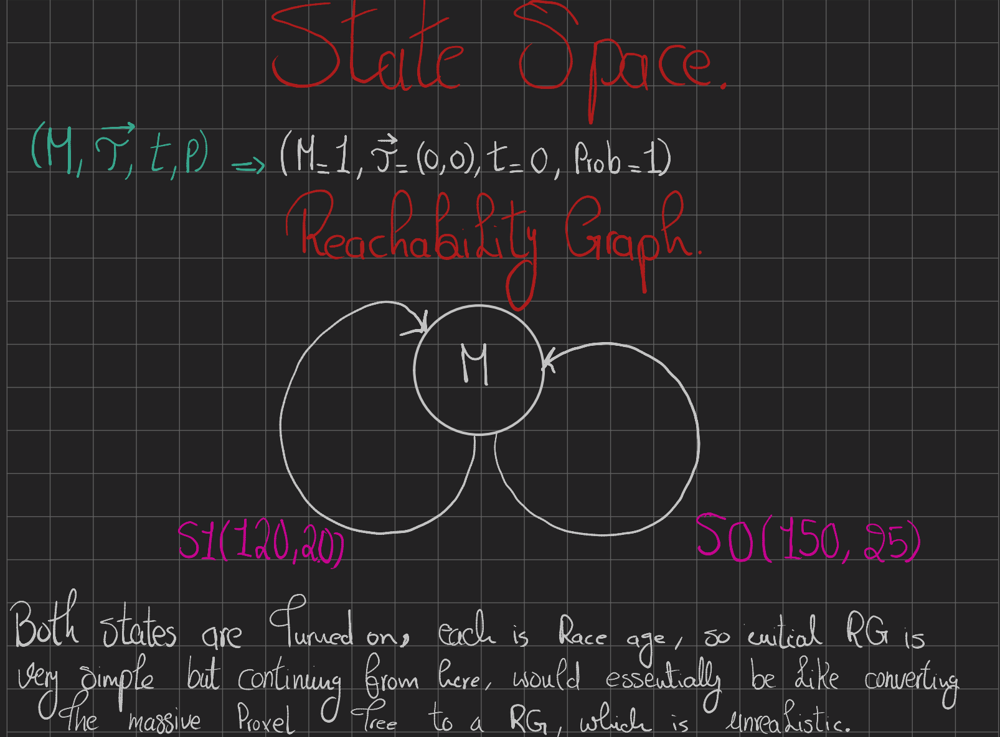

# Phase 4: Proxel State Exploration - Wafer Quality Tester

## System Specification
The system evaluates a stochastic quality tester processing items from two asynchronous sources via a Race-Age Discrete-Time model. 
- **Source 0**: Normal Distribution $N(150, 25)$. Probability of testing OK: $0.90$.
- **Source 1**: Normal Distribution $N(120, 20)$. Probability of testing OK: $0.95$.
- **Time Unit**: $1s$.

## Evaluation Objectives
1. Compute the average number of parts tested within one hour ($3600s$) across varying integration time steps ($\Delta t \in \{20, 10, 5, 2\}$).
2. Isolate the count of defective parts processed from Source 0 and Source 1 under the same time step configurations.

## Architecture
- **Proxel Engine**: Replaces traditional DES or Markov Chain generation with Probability Elements (Proxels) to track continuous age variables concurrently.
- **Midpoint Rule Integration**: Samples the instantaneous rate function (IRF) at $\tau + \Delta t / 2$ to mitigate numerical instability during the $O(n)$ state expansion.