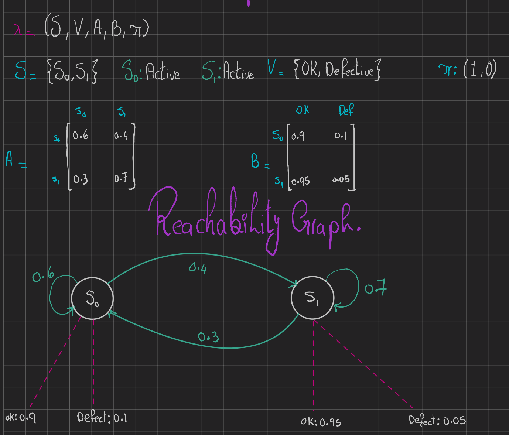

# Phase 5: Hidden Markov Model (HMM) Inference Engine

## System Architecture
This module implements a deterministic probability solver for evaluating and decoding hidden stochastic processes. The system models a singular quality tester fed by two distinct material sources




## Process Mechanics
**State Space:** Source 0, Source 1. Only one source achieves active state per processing cycle.
**Transition Probabilities:** Switching probability from Source 0 to Source 1 is 0.4. Switching probability from Source 1 to Source 0 is 0.3
**Initial Vector:** Operations initialize deterministically at Source 0
**Emissions Vector:** The system produces one item per cycle. Quality testing yields an 'OK' result with $p=0.9$ for Source 0, and $p=0.95$ for Source 1

## Core Algorithms
1. **Forward Algorithm (`solve_forward`)**: Computes the exact marginal probability of specific sequential observation traces.
2. **Viterbi Algorithm (`solve_viterbi`)**: Decodes the single most probable sequence of internal hidden states given an observed trace sequence.
3. **Beam Search (`solve_beam_search`)**: Implements $K$-width trajectory pruning to maintain computationally efficient path evaluations.

## Cross-Module Dependencies
System equilibrium analysis requires dynamic integration with Phase 1 components.
* Dependency: `01_dtmc_baseline/src/dtmc.py`
* Function: Resolves $\pi = \pi P$ to construct the exact stationary distribution vector prior to HMM evaluation.

## Execution
```bash
python src/main.py