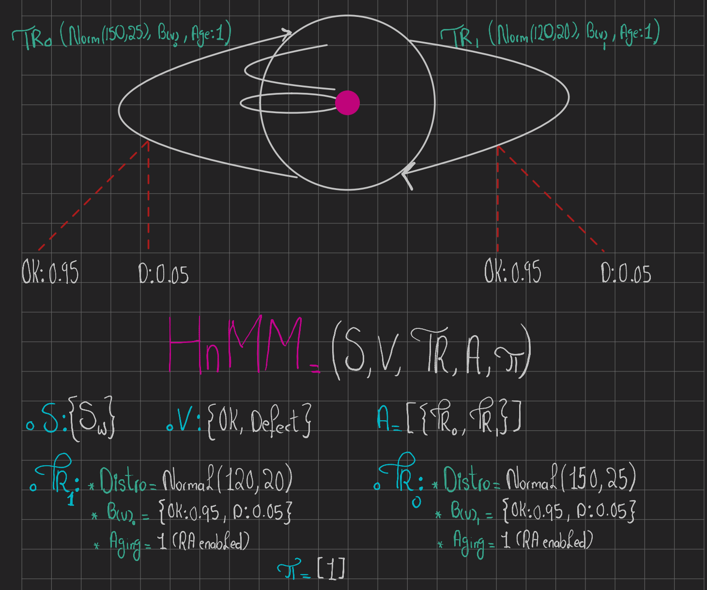

# 06_HnMM_advanced_inference/README.md

## System Architecture
This module implements the supervised machine learning pipeline ("Student" model) trained on ground-truth labels generated by the HnMM ("Teacher" model)

## Engineering Context
Initial heuristic approaches, specifically Threshold and Burst classification, failed due to the superposition problem and variance accumulation. To solve the core source identification problem within the semiconductor manufacturing line , the system utilizes a physics-based Proxel solver to generate rigorous labels. This module engineers Markovian lag features and rolling context windows to train a highly optimized XGBoost classifier capable of real-time operational execution.

## Directory Structure
* `requirements.txt`: Isolated dependency graph.
* `src/features.py`: Time-series mathematical feature engineering.
* `src/classifier.py`: XGBoost ML architecture and evaluation logic.
* `src/main.py`: Central ETL, inference, and training execution protocol.