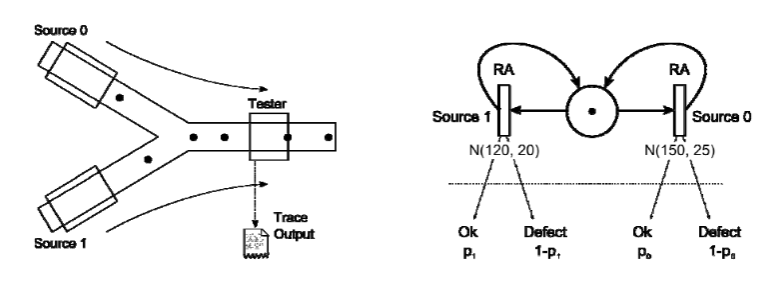

<div align="center">

# ⚡ Wafer Defect Stochastic Analyzer

**Stochastic inference engine for isolating hardware failures in semiconductor production lines**

[](https://python.org)
[](./LICENSE)
[](https://pytest.org)

</div>

---

## The Problem

A wafer production line has two upstream machines feeding a single quality tester. The tester logs high-frequency timestamps and binary states — **OK** or **Defect** — but has zero source telemetry. No barcode. No RFID. Just a stream of pass/fail verdicts.

**Which machine is poisoning the yield?**

This project answers that question by reconstructing the hidden upstream dynamics from incomplete observations alone — using six progressively more powerful stochastic frameworks.

---

## System Architecture



Two material flows merge at a quality gate. The engine processes this incomplete log to statistically identify the upstream machine responsible for an anomalous defect rate.

---

## The Pipeline

Six engines. One escalating analytical arc.

| # | Module | Framework | What It Solves |
|---|--------|-----------|---------------|
| 01 | `dtmc_baseline` | **Discrete-Time Markov Chain** | Foundational state transitions, steady-state distributions |
| 02 | `ctmc_kinetics` | **Continuous-Time Markov Chain** | Time-dependent failure rates, uniformization convergence |
| 03 | `gspn_concurrency` | **Generalized Stochastic Petri Net** | Async material flow, throughput analysis |
| 04 | `proxel_state_exploration` | **Proxel (Probability Element)** | Non-exponential inter-arrivals via Race-Age discrete simulation |
| 05 | `hmm_inference` | **Hidden Markov Model** | Mapping observable outputs → hidden machine states (Forward, Viterbi, Beam) |
| 06 | `HnMM_advanced_inference` | **Hidden non-Markovian Model + ML** | Full Teacher-Student pipeline: HnMM ground-truth labeling → XGBoost real-time classifier |

Each phase builds on its predecessor. By Phase 6, the system doesn't just model — it *learns*.

---

## Core Competency

**Algorithms & Models**
`DTMC` · `CTMC` · `Uniformization` · `GSPN / Extended Reachability Graphs` · `Proxel Simulation` · `Race-Age Models` · `Hazard Rate Functions` · `HMM (Forward / Viterbi)` · `Beam Search` · `Hidden non-Markovian Models` · `Log-Space Numerical Methods` · `Matrix Exponential` · `Iterative Power Method` · `Trapezoidal Integration` · `A* Heuristic Pruning` · `Stratified K-Fold Cross-Validation`

**Programming Languages**
`Python 3.12+`

**Libraries & Frameworks**
`NumPy` · `SciPy` (linalg, stats, special) · `pandas` · `XGBoost` · `scikit-learn` · `Matplotlib` · `NetworkX` · `Tkinter`

**Mathematical Domains**
`Stochastic Processes` · `Linear Algebra` · `Probability Theory` · `Statistical Inference` · `Machine Learning` · `Numerical Methods`

**Software Engineering**
`pytest` · `Dataclass-driven design` · `Sorted-tree state management` · `File-based memoization` · `Cross-module dependency architecture` · `Asynchronous GUI simulation`

---

## Quick Start

```bash
# Clone
git clone https://github.com/Ayman-codes/wafer-defect-stochastic-analyzer.git
cd wafer-defect-stochastic-analyzer

# Set up (each module has its own requirements)
python -m venv venv && source venv/bin/activate   # or venv\Scripts\activate on Windows

# Run any phase — e.g. Phase 1 DTMC
pip install -r 01_dtmc_baseline/requirements.txt
python -m 01_dtmc_baseline.src.main

# Run the capstone (Phase 6: HnMM + XGBoost)
pip install -r 06_HnMM_advanced_inference/requirements.txt
python -m 06_HnMM_advanced_inference.src.main
```

---

## Project Structure

```
wafer-defect-stochastic-analyzer/
├── 01_dtmc_baseline/          # DTMC engine + MCMC visualizer
├── 02_ctmc_kinetics/          # CTMC engine + convergence sweep + rate diagram
├── 03_gspn_concurrency/       # GSPN → CTMC bridge + throughput analysis
├── 04_proxel_state_exploration/ # Race-Age Proxel simulation + hazard physics
├── 05_hmm_inference/          # Forward, Viterbi, Beam Search
├── 06_HnMM_advanced_inference/ # HnMM labeling + feature engineering + XGBoost
├── system_description.png      # Architecture diagram
└── LICENSE
```

Each module follows: `src/` (engine + main) · `tests/` · `README.md` · `requirements.txt`

---

## Testing

```bash
# Run all tests
pytest */tests/ -v

# Or per-module
pytest 01_dtmc_baseline/tests/ -v
```

---

## License

MIT — with an [anti-plagiarism clause](./LICENSE). Use it, learn from it, build on it. Don't submit it as your own coursework.

<div align="center">

*Built with stochastic rigor and a healthy distrust of clean yield data.*

</div>
